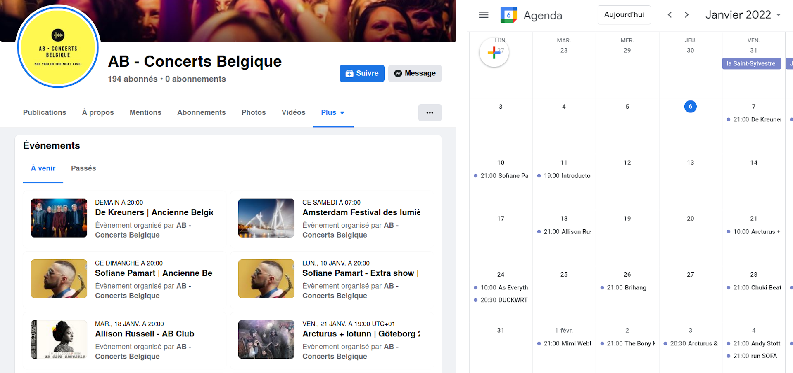

# Facebook events to ical

It will login to facebook, and create an iCal files containing all future events of the provided facebook pages

# install
* Node.js v v15.14.0 tested

```
git clone https://github.com/gmonein/FacebookPageEventsToIcals
```

```
cd FacebookPageEventsToIcals
npm install
```

# set login
Fill in username and password in creds.rem.js

Save file as: creds.js

# run
```
npm run start -- abconcerts.be tomorrowland burningman
> output file: ./events.ics
```
